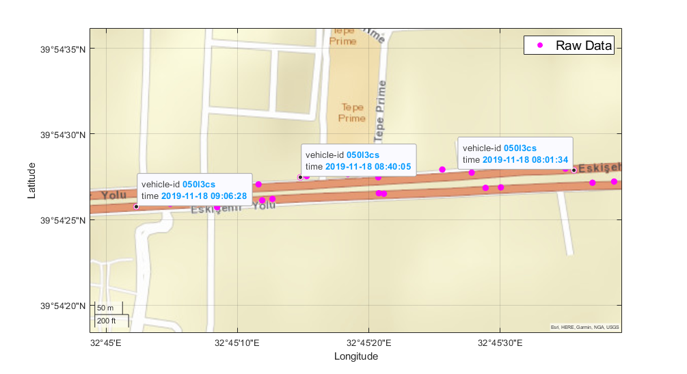

# Description of the Project
---
> *under construction*


This project is a part of an [TÜBİTAK 1501](https://www.tubitak.gov.tr/en/funds/industry/national-support-programmes/content-1501-industrial-rd-projects-grant-programme) project titled "*Konum verisi ile ulaşım analiz, planlama ve modelleme için büyük veri platformu geliştirilmesi*" (EN: Developing a big data platform for transportation analysis, planning and modelling with geodata)

## Contents

- [Raw Data and Scope of the Project](#raw-data-and-scope-of-the-project)
- [Processing the Data](#process-data)
  - [Map-Matching Algorithm](#map-matching-algo)
  - [Transformation and Filtering the Data](#transformation-and-filtering)
- [Finding](#findings)


## Raw Data and Scope of the Project





| Syntax | Description |
| ----------- | ----------- |
| Header | Title |
| Paragraph | Text |


```
{
  "firstName": "John",
  "lastName": "Smith",
  "age": 25
}
```

### My Great Heading {#custom-id}

~~The world is flat.~~

- [x] Write the press release
- [ ] Update the website
- [ ] Contact the media


> blockquote


---

[title](https://www.example.com)